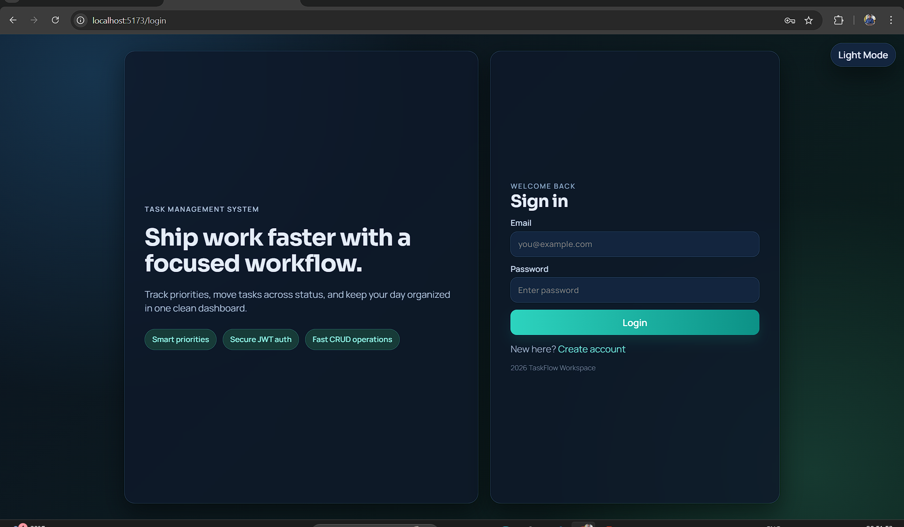
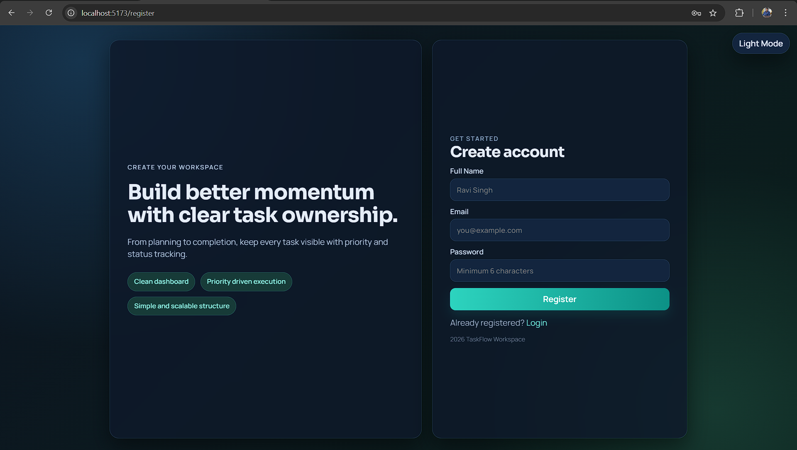
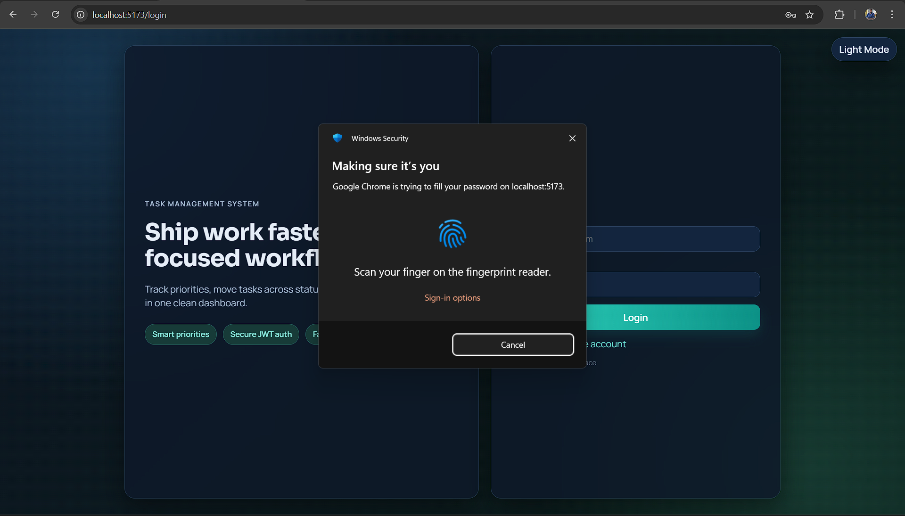
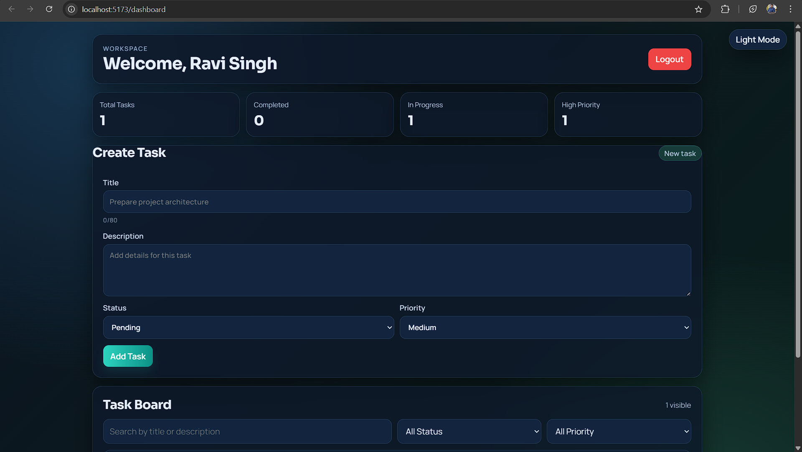

# Task Management System

A full-stack Task Management web application built using **React, Node.js, Express, and MongoDB**.
This application helps users organize, track, and manage daily tasks efficiently with a secure authentication system and a responsive user interface.

---

## Features

* User registration and login using **JWT Authentication**
* Create, update, and delete tasks
* Set task priority and status
* Add due dates and tags
* Search and filter tasks
* Archive and restore tasks
* Dashboard showing task statistics
* Responsive UI for better user experience

---

## Tech Stack

### Frontend

* React
* Vite
* Axios
* CSS / Modern UI Components

### Backend

* Node.js
* Express.js
* MongoDB (Mongoose)

### Security

* JWT Authentication
* bcrypt password hashing
* Input validation

---

## Project Structure

```
task-management-system
│
├── frontend   # React Application
└── backend    # Node.js Express API
```

---

## Local Setup

### 1. Clone Repository

```
git clone https://github.com/ravisingh5791/Task-Management-System.git
cd Task-Management-System
```

### 2. Run Backend

```
cd backend
npm install
npm start
```

### 3. Run Frontend

```
cd frontend
npm install
npm run dev
```

Frontend runs on
http://localhost:5173

Backend runs on
http://localhost:5000

---

## API Endpoints

### Authentication

* POST /api/auth/register
* POST /api/auth/login
* GET /api/auth/me

### Tasks

* GET /api/tasks
* POST /api/tasks
* PUT /api/tasks/:id
* DELETE /api/tasks/:id

---

## What I Learned

* Building secure authentication systems
* Creating REST APIs using Express.js
* Managing MongoDB databases using Mongoose
* Connecting React frontend with backend APIs
* Structuring scalable full-stack applications

---

## Future Improvements

* Kanban drag-and-drop task board
* Notifications for due tasks
* File attachment support
* Deploy application on cloud platform

---

## Resume Summary

Developed a full-stack Task Management System using **React, Node.js, Express, and MongoDB** with secure authentication and complete CRUD functionality.

---

Author
Ravi Singh

## Screenshots

### Login Page


### Register Page


### User Authentication


### Dashboard

